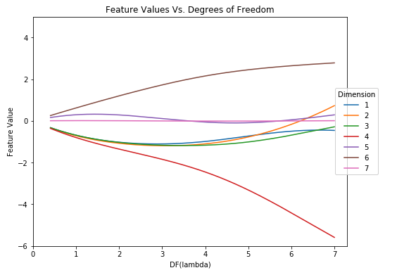
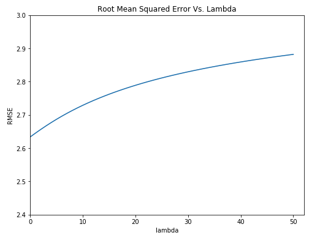
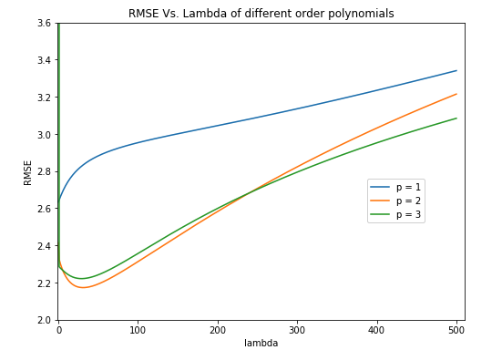

# Ridge Regression from scratch

The goal of this project was to create an efficient pth-order polynomial Ridge Regression model. We will test it the model by predicting the miles per gallon a car will get using six features about that car.

## Data

The data is broken into training and testing sets. Each row in both “X” files contain six features for a single car (plus a 1 in the 7th dimension) and the same row in the corresponding “y” file contains the miles per gallon for that car.

## Technology Used
- Python 3

## Some Results

Dimensions 4 and 6 clearly stand out, one consistently decreasing as the degrees of freedom of lambda increases and the other consistently increasing respectively. We can assess that these dimensions are very important. As df(λ) increases, the values of features 4 and 6 play a greater role in making predictions. Those weights, when multiplied by their corresponding feature, will more greatly determine the value of y. The other feature weights are closer to 0 and hence those corresponding features will have a lower weight when multiplied by their corresponding value, making less of an impact on predicting y. Regularization is meant to penalize the loss function, adding a penalty on models with large coefficients. As lambda increases, there must not be a severe penalty on those weights, meaning that they are important for predictions, as seen by their values as df(λ) increases.

This figure tells us that for this problem, the lowest root mean squared error is achieved when λ = 0. Thus, for this problem, we would choose λ = 0, meaning that we would choose least squares over ridge regression. The root mean squared error just increases as λ increases. This is all with respect to this data set and working with a first order polynomial.

Based on this plot, I would choose a p value of 2. A p value of 2 has a significantly lower root mean squared error than a p value of 1. It also only slightly differs from the root mean squared error of a p value of 3. A p value of 2 will lead to less dimensions than a p value of 3 and hence a less complex model. It is by far the best tradeoff between model complexity and root mean squared error since the difference in RMSE is so small. With p = 1, the ideal λ value is 0. Here, we see that the root mean squared error decreases as lambda increases from 0. The minimum root mean squared error is right about when λ = 24 for p = 2. It then begins to increases again once lambda is around 30. For this particular problem I would use the lambda value of 24 with p = 2.